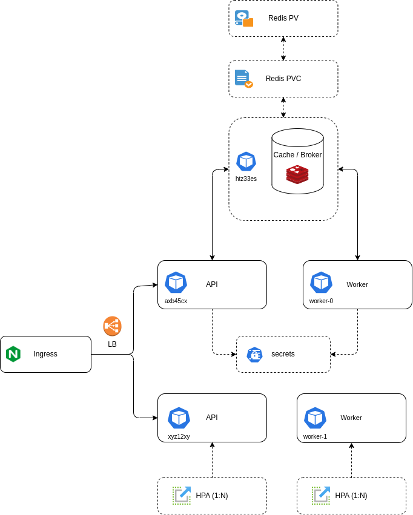

# Cluster Architecture

## Overview
Currently I'm using a k8s cluster running on microk8s with a scalable architecture designed for high availability and performance.

## API Layer
- The API service is deployed using a ReplicaSet configuration.
- Each API pod is configured to read secrets from Kubernetes secrets store.
- Horizontal Pod Autoscaler (HPA) is configured to automatically scale the API pods based on demand.

## Worker Layer
- Worker pods are managed by StatefulSets.
- This ensures stable network identifiers and persistent storage for each worker instance.
- StatefulSets provide ordered deployment and scaling.
- Workers also have access to Kubernetes secrets for secure configuration.
- HPA is configured for worker pods to handle varying workloads.

## Load Balancing and Routing
- Ingress controller is configured to distribute incoming requests.
- The ingress routes traffic to the appropriate API services within the cluster.
- Provides SSL termination and path-based routing.

## Scaling Configuration
- Both API and Worker pods are configured with Horizontal Pod Autoscalers (HPA).
- Scaling is based on CPU and memory metrics.
- Ensures optimal resource utilization and performance under varying loads.

## Messaging System
- Distributed task queue system using Celery
- Redis deployed as message broker
- Workers are configured as stateful pods
- Each worker instance maintains its own Redis connection
- Supports asynchronous task processing and scheduling
- Task results are stored in Redis for reliability
- Workers can be scaled independently based on workload